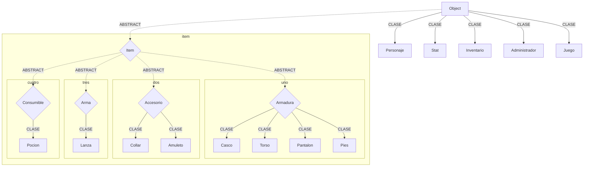

# Diagrama hecho con Mermaid:

# Implementaciones.

> Justificar la existencia de las clase que heredan Armadura, Arma, Accesorio y Consumible. --> Importante.

> Hacer funcionar el metodo desequiparItem de la clase Personaje y RemoverItemDeEquipamiento de la clase Inventario. No funciona especificamente con las Armas.

> Arreglar error de que un peleador puede pelear contra el mismo.

> Arreglar error al defender que permite que un personaje tenga el buffo de la armadura indefinidamente.

> Agregar metodo para poder volver al menu, para evitar casos de softlock.

> Darle funcionalidad al atributo inteligencia y que sirva para aumentar el ataque, asi como que aumente la probabilidad de golpes criticos.

> Agregar la probabilidad de golpes criticos.
