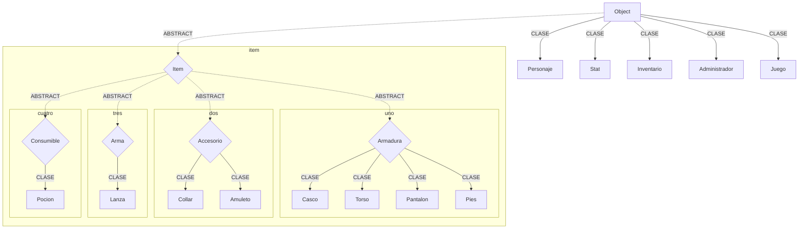

```mermaid
flowchart 
    A[Object] -.ABSTRACT.-> Item{Item}
    subgraph item
        Item -.ABSTRACT.-> Armadura{Armadura}
        subgraph uno
            Armadura -->|CLASE| Casco[Casco]
            Armadura -->|CLASE| Torso[Torso]
            Armadura -->|CLASE| Pantalon[Pantalon]
            Armadura -->|CLASE| Pies[Pies]
        end
        Item -.ABSTRACT.-> Accesorio{Accesorio}
        subgraph dos
            Accesorio -->|CLASE| Collar[Collar]
            Accesorio -->|CLASE| Amuleto[Amuleto]
        end
        Item -.ABSTRACT.-> Arma{Arma}
        subgraph tres
            Arma -->|CLASE| Lanza[Lanza]
        end
        Item -.ABSTRACT.-> Consumible{Consumible}
        subgraph cuatro
            Consumible -->|CLASE| Pocion[Pocion]
        end
    end
    A[Object] -->|CLASE| Personaje[Personaje]
    A[Object] -->|CLASE| Stat[Stat]
    A[Object] -->|CLASE| Inventario[Inventario]
    A[Object] -->|CLASE| Administrador[Administrador]
    A[Object] -->|CLASE| Juego[Juego]
```
